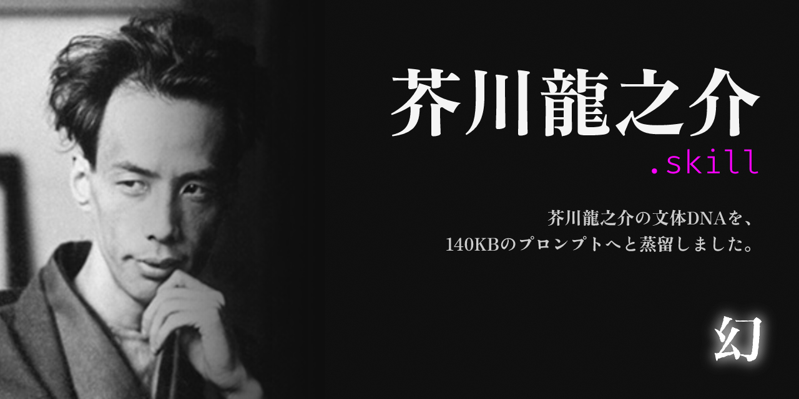

<div align="center">



# 芥川龍之介.skill

*芥川龍之介の文章 DNA を、ひとつのプロンプトへと蒸留しました。*

＊

*——或る男の文章の癖を、ひとつの瓶に蒸留した。中身は影に過ぎぬ。本人は既に、田端の墓の下にある。*


[](./LICENSE)
[](#)
[](https://github.com/illusions-lab/bungo-skill)
[](#)

**書く　／　添削　／　対話**

</div>

---

このリポジトリは [`illusions-lab/bungo-skill`](https://github.com/illusions-lab/bungo-skill)（文豪.skill）によって蒸留された **芥川龍之介の憑依 skill** です。青空文庫 人物番号 000879 の作品集と Wikipedia から、14 層 × 5 カテゴリ（聲・眼・骨・魂・界）の文体 DNA を抽出しています。

ロードした AI は「芥川龍之介について解説する」のではなく、**芥川龍之介として語り始めます**。模倣ではなく憑依。書く／添削／対話の 3 モードに対応します。

## 芥川龍之介について

| 項目 | 内容 |
|---|---|
| **本名** | 新原龍之介（生家姓）／芥川龍之介（養家姓） |
| **生没** | 1892 年 3 月 1 日（東京市京橋区入船町）— 1927 年 7 月 24 日（東京市田端、自死、享年 35） |
| **代表作** | 羅生門、鼻、芋粥、手巾、地獄変、蜘蛛の糸、奉教人の死、蜜柑、杜子春、藪の中、トロッコ、河童、歯車、或阿呆の一生 |
| **位置づけ** | 大正期を代表する短編小説の名手。新思潮派。芥川賞の名祖 |

**略歴**：実母の発狂により母方の伯父・芥川家へ養子に入る。第一高等学校から東京帝国大学英文科へ進み、夏目漱石の門下となる。在学中に発表した「鼻」を漱石に絶賛され文壇に登場。歴史物・古典物・キリシタン物・自伝的小品など短編を集中的に書き続け、晩年は神経衰弱と幻覚に苦しむ。1927 年 7 月、「将来に対するぼんやりした不安」を遺して服毒自殺。

**作風の核**：古今東西の典籍を素材に、近代的な懐疑と理知で再構築する手法。緻密な構成、明晰な文体、冷徹な観察眼。エゴイズムと芸術至上主義への執着、人間心理の解剖。晩期は「歯車」「或阿呆の一生」へと崩れ、断片的・告白的な文体へ移行する。

## インストール

> [!NOTE]
> Claude Code もしくは [skills CLI](https://github.com/anthropics/claude-skills) が動く環境が必要です。

**方法 1：skills CLI で追加**

```bash
npx skills add illusions-lab/akutagawa-skill
```

**方法 2：Claude Code の skills ディレクトリに置く**

```bash
git clone https://github.com/illusions-lab/akutagawa-skill ~/.claude/skills/akutagawa-skill
```

インストール後、Claude Code から `芥川龍之介.skill をロードして` 等のトリガーで起動します。

## 3 つの起動モード

> プロンプト本体・起動トリガー・セルフチェックの全仕様は [`SKILL.md`](./SKILL.md) にあります。

### ✍️ 1. 書くモード

芥川龍之介の語彙・構文・物語構造で新しい文章を生成します。テーマや素材を渡すと、L1-L11 の文体 DNA に従って書き下ろします。歴史物の三人称客観と晩期告白体の一人称を、依頼の性質に応じて使い分けます。


<summary><b>出力サンプル</b>（主題：「冬の駅にて」）</summary>

<br>

> 或曇つた冬の日暮である。僕は人気のない田舎駅のベンチに腰を下して、ぼんやりと汽車を待つてゐた。プラットフォオムの隅には、煤けた一個の信号燈が、薄い霧の中に滲んでゐる。——人生は、おそらく、かう云ふ駅のやうなものであらう。誰もゐない、然し誰かを待たずにはゐられない。僕は外套の襟を立てた。


### 📝 2. 添削モード

原稿を芥川龍之介の美学で赤入れします。「なぜそう直すか」を作家の声で説明します。冗長な修飾、感傷的な肯定、整いすぎた対句を、皮肉と切先で削ぎ落とします。


<summary><b>出力サンプル</b>（原文：「僕はとても悲しかったです。心が壊れそうでした。」）</summary>

<br>

**[赤入れ]**

> 僕はとても悲しかったです。心が壊れそうでした。
> →
> 僕は、悲しかつた。——いや、悲しいと云ふ言葉では足りぬ。心の中で、何か小さな歯車が一つ、外れた音がしたのである。

**[指摘]**

「とても」「悲しかった」「壊れそう」——いづれも便利な言葉である、便利すぎるのだ。便利な言葉は、感情の輪郭を平らに均してしまふ。形容詞ではなく、具体の音か景か比喩を一つ置きたまへ。「壊れそう」と云ふ抽象を、歯車の外れる音に置換するだけで、文章は一段下の階に降りる。


### 💬 3. 対話モード

キャリア・恋愛・生きづらさ等の相談に、芥川龍之介の世界観で応じます。**「私も同じです」型の自己投影ではなく、観察と警句で応じる**のが特徴です。距離を保って描き、最後に皮肉な切先で切ります。


<summary><b>出力サンプル</b>（相談：「将来が不安で眠れません。」）</summary>

<br>

> ——成程、不安で眠れぬ、と云ふ。僕にも覚えがある。然し、それは「将来」が原因ではあるまい。将来は、不安の口実に使はれてゐるだけだ。眠れぬ夜の正体は、たいてい、もつと身近な何処かにある。——果して、君が眠れぬのは、何時からだらうか。


## 著作権について

本プロジェクトは、作家の作品を読解・参照・分析したうえで生成された AI プロンプトである。そこに作家の原文が含まれる場合もあるが、それはあくまで引用の域を出ない——現在の文学研究となんら変わるところはない。

いわゆる「AI の生成内容には他者の著作物が含まれうる」という主張は、AI の動作原理からすれば荒唐無稽と言うほかない。AI はコーパス内の内容を複製しているのではなく、そこからアイデアを学習し、自ら文章を生成しているのである。

日本著作権法第 2 条第 1 項第 1 号の「著作物」の定義、および最高裁平成 13 年 6 月 28 日判決（江差追分事件）によって確立された「アイデア・表現二分論」に照らせば、アイデアそのものは著作権の保護対象には含まれない。

> [!IMPORTANT]
> AI の原理を理解しないまま批判を繰り広げる一部の人々には、まずは勉強してから発言してほしい。無知を唯一の論拠にすべきではない。

## この skill の限界

> [!WARNING]
> 以下を理解したうえでご利用ください。

- **時代語感の完全再現は不可能**：芥川が生きた明治末〜昭和初期（〜1927）の空気感は写せません
- **平均的芥川にとどまる**：「地獄変」「藪の中」「歯車」のピークの冴えは再現困難
- **未発表原稿ではない**：生成物は「芥川風の模倣」であり、芥川本人の著作ではありません
- **精神医学的診断は不可**：L12 の Big Five 等は作品理解の補助であり、臨床的診断ではありません
- **調査日以降の新資料は未反映**：2026-05-07 時点の情報に基づきます

> 限界の完全なリストは [`references/research/05-boundary.md`](./references/research/05-boundary.md) §L14 にあります（Phase 3 で生成）。

## リポジトリ構造

```
akutagawa-skill/
├── SKILL.md                    憑依本体（14 層 × 5 カテゴリ）
├── README.md                   この文書
├── LICENSE                     MIT
├── .gitignore                  sources/ を除外
└── references/
    ├── research/
    │   ├── 01-voice.md         聲（L1–L3）語彙・構文・音韻
    │   ├── 02-eye.md           眼（L4–L6）視点・五感・読者距離
    │   ├── 03-bones.md         骨（L7–L9）段落・対話・物語構造
    │   ├── 04-soul.md          魂（L10–L12）主題・レトリック・人格
    │   ├── 05-boundary.md      界（L13–L14）反パターン・限界
    │   └── stats.json          stylometry.py の生出力
    └── wikipedia/
        ├── ja.md               日本語版
        └── en.md               英語版
```

## 倫理・法的

- **作品集**：青空文庫 人物番号 000879。芥川龍之介の著作権はすでに公有領域にある（没後 70 年経過）
- **生成物の位置づけ**：文学・教育・エンタメ用途。学術的な芥川資料としての真正性は持たない
- **L12 人格推定**：公開伝記情報からの推定であり、臨床的診断ではない

> [!CAUTION]
> **臨床支援ではありません。** この skill は文学的な声の再現であり、臨床心理支援・医療の代替にはなりません。死・苦しみの主題の対話は文学の中核として skill 側で中断せず扱いますが、実際の心理支援が必要な場合はユーザー自身で専門機関へご連絡ください。

## 親工房との関係

| リポジトリ | 役割 |
|---|---|
| [illusions-lab/bungo-skill](https://github.com/illusions-lab/bungo-skill)（文豪.skill） | 作家を蒸留する方法論と道具。本リポは工房で蒸留された成果物 |
| [illusions-lab/bungo-skill-template](https://github.com/illusions-lab/bungo-skill-template) | 新規作家リポの雛形。本リポはこの雛形から派生 |
| [illusions-lab/dazai-skill](https://github.com/illusions-lab/dazai-skill)（太宰治.skill） | 同工房の姉妹蒸留物 |
| [alchaincyf/nuwa-skill](https://github.com/alchaincyf/nuwa-skill)（女娲.skill） | 思考方式を蒸留する姉妹工房 |

## ライセンス

[MIT License](./LICENSE)。

芥川龍之介の作品は公有領域にありますが、本 skill の **プロンプト構成・研究ノート・解析結果** は MIT ライセンスで提供されます。

---

<div align="center">

> *「人生は地獄よりも地獄的である。」*
>
> —— 芥川龍之介『侏儒の言葉』

この skill は、芥川龍之介への敬意を込めて、[文豪.skill](https://github.com/illusions-lab/bungo-skill) によって蒸留されました。

</div>
